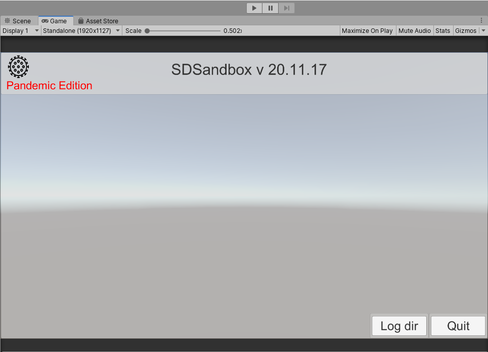
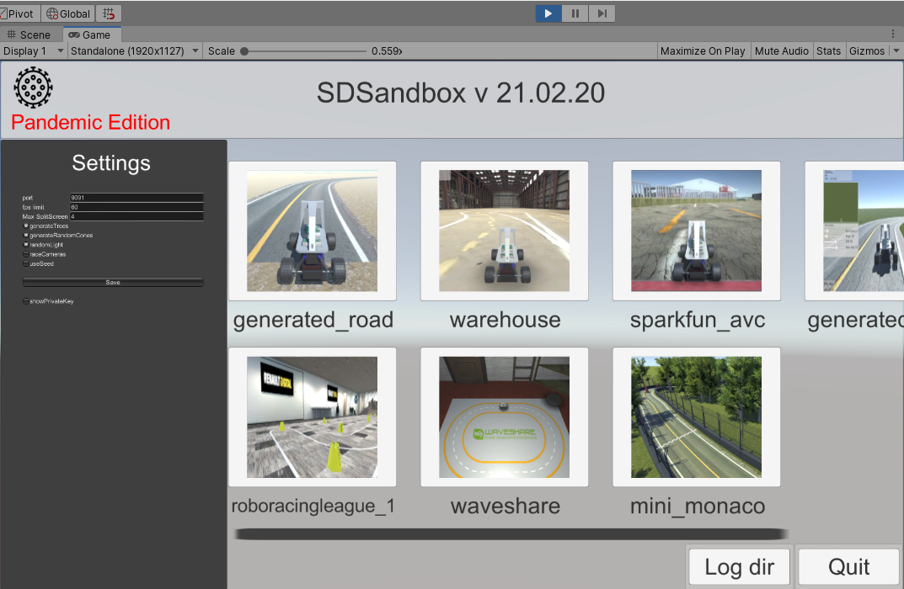
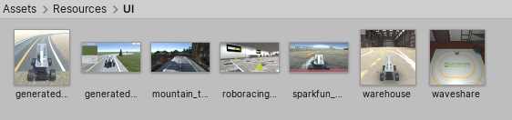

# On the go menu buttons creation
Those buttons are created during runtime from a Button prefab "Assets/Prefabs/UI/Button.prefab",  
if you don't run the simulator, the menu should look like that:  

The TcpMenuHandler script creates a button per item in the "Scene_names" list,  
so for each items:
* instantiation of a new game object from the Button prefab
* the name is changed according to the name of the item (name of the scene)
* adds a listener so that when the button is clicked it will load the given scene.
* finally, it checks if an image is existing under the same name in "Assets/Resources/UI/" and loads it, either it keeps the default donkeycar image.

here is how the menu looks at runtime:  

The images are stored in: [sdsim/Assets/Resources/UI](../../sdsim/Assets/Resources/UI)  
  
and [here](../../sdsim/Assets/Textures/UI/donkey-car-graphic_orig.jpg) is the default button image  
  

You can also find the TcpMenuHandler script [here](../../sdsim/Assets/Scripts/tcp/TcpMenuHandler.cs)