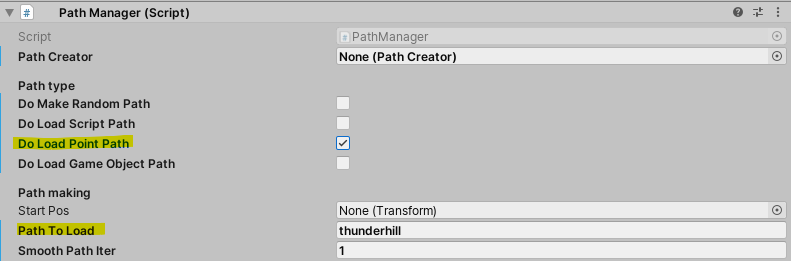
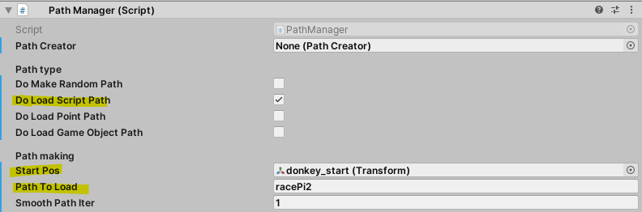
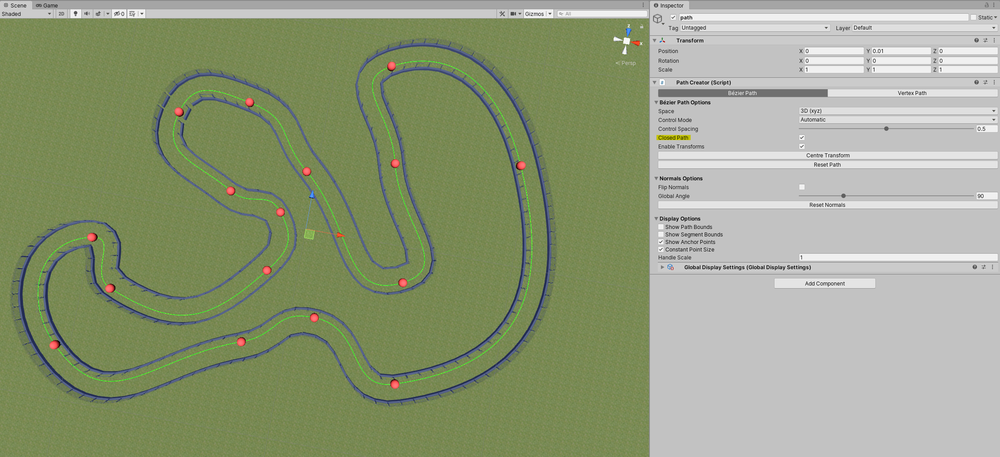
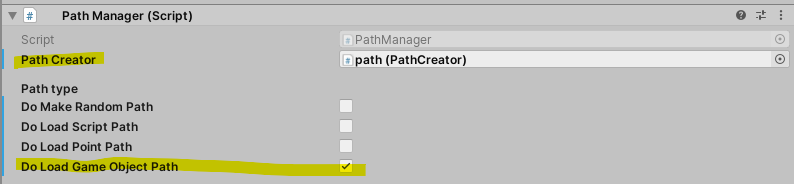
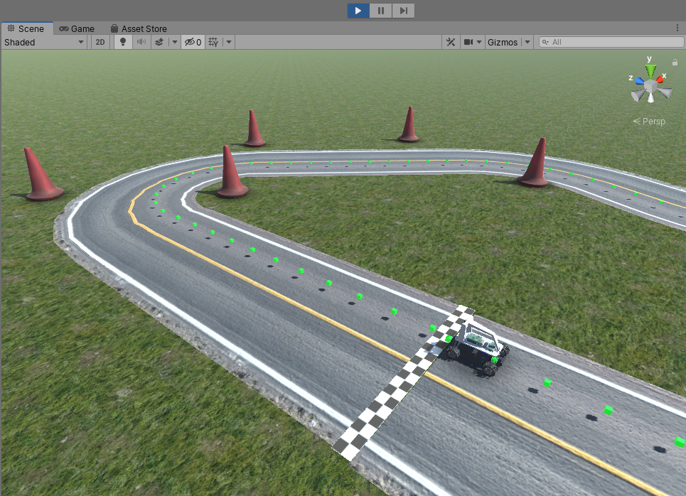

# PathManager.cs

This script is usefull to load circuit path located in "Assets/Resources/Track/"
This path can then be transferred to the RoadBuilder script to generate the road according to it.

from there, you have three major options:
* ## Point Path
    This method is pretty basic, some XYZ points are stored in a .txt file, at runtime those points are loaded and that's basically it. <br>
    Those points can be obtained by driving a car and fetching some XYZ data and then storing them into a .txt file. <br>
    here is an extract of a point path:
    ```
    50.11026,0.7395915,58.08049
    50.09185,0.7396246,60.14838
    50.0519,0.7391528,62.22726
    49.77075,0.7394963,64.24397
    49.49672,0.7390662,66.27354
    49.21761,0.739813,68.29779
    48.92772,0.7391199,70.30378
    48.43103,0.7389708,72.33326
    47.89476,0.7397314,74.31959
    47.29712,0.7393003,76.32899
    46.47854,0.7394732,78.24893
    45.66554,0.7393689,80.15755
    44.83092,0.7394504,82.04145
    43.83861,0.7390966,83.82599
    42.83435,0.7397145,85.5895
    41.83722,0.7395042,87.34274
    40.84626,0.7394902,89.08534
    ```
    

* ## Script Path
    The script path is more compact than the point path method. <br>
    It's quite hard to make one, so you basically need to trial and error and shape the circuit segment by segment whereas with the point path you can easily drive a car and fetch the XYZ position of the car. <br>
    here is an example of a script path:
    ```
    S 11
    DY 15.5
    R 9
    S 10
    DY 10
    R 7
    S 2
    DY 5
    L 15
    S 5
    DY 15
    R 9
    S 10
    DY 11
    R 8
    S 10
    DY 3
    R 1
    S 11
    ```
    

* ## Game Object Path (PathCreator)
    this method allows you to creat/modify a path directly in the editor. <br>
    make sure you selected "Closed Path".
    
    

## debugging
for debugging purposes you can enable the "Do Show Path" property in the Hierarchy tab to show the loaded path, some green cubes will then be showed at runtime, it should looks like that: <br>
