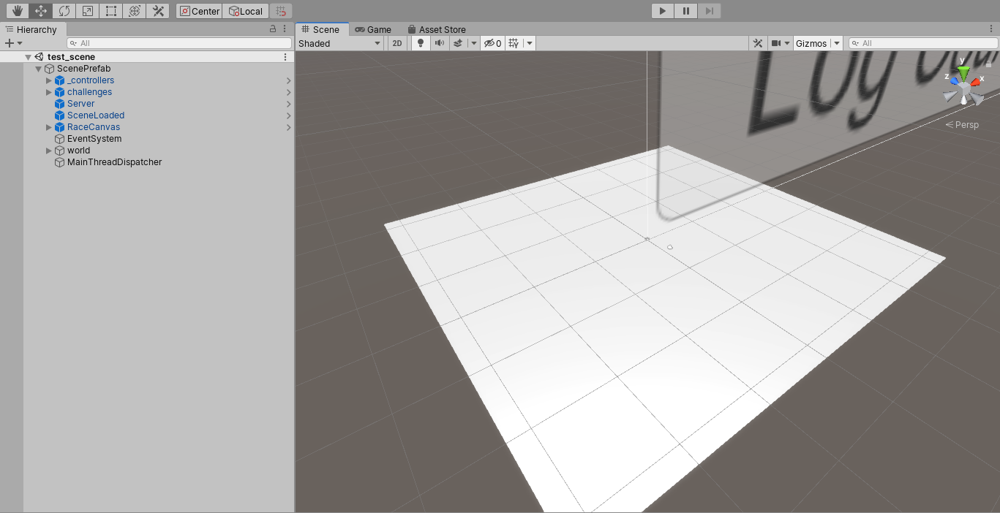
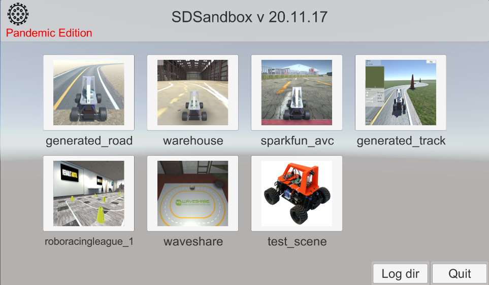

# Create Your Own Track
This guide will explain to you how to create your own track.

## Create a new scene
1) Go to the "Assets/Scenes/".
2) Right click in there, select "Create > Scene".
3) Rename the scene to watever you want your track to be named.
4) Double click on the scene to open it.
5) you can delete everything in the scene from the Hierarchy tab.

## Apply the scene prefab
1) In "Assets/Prefabs/" you will find a Prefab called "ScenePrefab".
2) Drag and drop this prefab into the Hierarchy tab of your new scene, you should see the prefab appear.
3) Right click on the prefab and select "Unpack Prefab", this will disociate the object in your scene from the Prefab stored in "Assets/Scenes/".

you should be then leaved with something that looks like that:  

## Quick explanation on the ScenePrefab
This prefab contains everything you need to "donkeyfie" the scene,  
it contains some controllers to modify the look of the generated road, the starting line location, etc...  
But what will interest you the most here is in "ScenePrefab/world/", in there you will find everything that is related to the scene looking.

## Add your new scene to the menu !
Before adding some fancy textures and add some objects to your scene, I recommend adding your scene to the menu; this could be done at any moment of the scene creation process.  

1) So now lets load the "menu" Scene located in "Assets/Scenes/", double click on it
2) Click on the "_TcpMenuController" object in the Hierarchy tab
3) In the Inspector tab,, look at the "Tcp Menu Handler" script, click on the "Scene_names" component to develop it.
4) Enlarge the list by 1 element and add the name of your scene in the last element of the list

From there, you are all set to continue developping your scene.  
Note: you can also click the run button in the menu scene to see how the menu looks, you can also try to click on the button to see if it's redirecting you well to your new scene. It should look like this:  

If you are wondering how does the buttons are created at runtime, go see the [menu buttons documentation](../advanced/menu_buttons.md)
